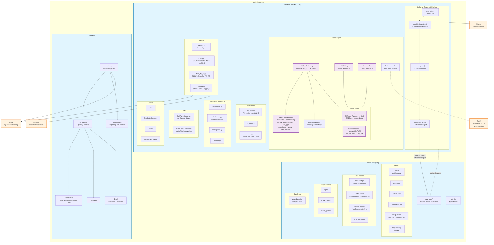

# Hooke Architecture

ML models for biological perturbation prediction.

```mermaid
graph TB
    subgraph Monorepo["Hooke Monorepo"]

        subgraph PX["hooke-px (hooke_forge)"]
            direction TB

            subgraph Pipeline["Schema-Governed Pipeline"]
                direction LR
                Splits["splits_step()<br/>→ SplitsOutput"]
                Cond["conditioning_step()<br/>→ ConditioningOutput"]
                Pretrain["pretrain_step()<br/>→ PretrainOutput"]
                Infer["inference_step()<br/>→ InferenceOutput"]
                Splits --> Cond --> Pretrain --> Infer
            end

            subgraph Model["Model Layer"]
                direction TB
                FM["JointFlowMatching<br/><i>flow matching + ODE solver</i>"]
                Drift["JointDrifting<br/><i>drifting approach</i>"]
                MF["JointMeanFlow<br/><i>1-NFE mean flow</i>"]

                subgraph VectorFields["Vector Fields"]
                    DiT["DiT<br/><i>Diffusion Transformer (Px)</i><br/>DiTBlock + adaLN-Zero"]
                    CondMLP["ConditionedMLP<br/><i>3-stream MLP (Tx)</i><br/>mlp_xt · mlp_c · mlp_ut"]
                end

                CtxEnc["TransformerEncoder<br/><i>metadata → conditioning</i><br/>rec_id · concentration · cell_type<br/>experiment · assay · well_address"]
                ScalarEmb["ScalarEmbedder<br/><i>timestep embedding</i>"]
                TxAE["Tx Autoencoder<br/><i>Perceiver + ZINB</i>"]

                FM --- VectorFields
                Drift --- VectorFields
                MF --- VectorFields
                FM --- CtxEnc
                FM --- ScalarEmb
            end

            subgraph Training["Training"]
                Trainer["trainer.py<br/><i>main training loop</i>"]
                TrainFM["train.py<br/><i>SLURM launcher (flow matching)</i>"]
                TrainTxAE["train_tx_ae.py<br/><i>SLURM launcher (Tx AE)</i>"]
                State["TrainState<br/><i>shared state + logging</i>"]
            end

            subgraph Evaluation["Evaluation"]
                PxMetrics["px_metrics<br/><i>FD, cosine sim, PRDC</i>"]
                TxMetrics["tx_metrics"]
                EvalScript["eval.py<br/><i>offline checkpoint eval</i>"]
            end

            subgraph Inference["Distributed Inference"]
                RunWorker["run_worker.py"]
                DistInfer["distributed.py<br/><i>SLURM multi-GPU</i>"]
                Checkpoint["checkpoint.py"]
                Lineage["lineage.py"]
            end

            subgraph Data["Data"]
                Dataset["CellPaintConverter<br/><i>zarr-backed dataset</i>"]
                Tokenizer["DataFrameTokenizer<br/><i>metadata tokenization</i>"]
            end

            subgraph Utils["Utilities"]
                EMA["EMA"]
                DistUtil["Distributed helpers"]
                Profiler["Profiler"]
                InfLoader["InfiniteDataLoader"]
            end
        end

        subgraph TX["hooke-tx"]
            direction TB
            TxMain["main.py<br/><i>Hydra entrypoint</i>"]
            TxTrainer["TxPredictor<br/><i>Lightning module</i>"]
            TxDataMod["DataModule<br/><i>Lightning datamodule</i>"]
            TxArch["Architecture<br/><i>MLP + Flow Matching + ODE</i>"]
            TxEval["Eval<br/><i>inference + baselines</i>"]
            TxCallbacks["Callbacks"]

            TxMain --> TxTrainer
            TxMain --> TxDataMod
            TxTrainer --> TxArch
            TxTrainer --> TxCallbacks
            TxTrainer --> TxEval
        end

        subgraph Eval["hooke-eval (vcb)"]
            direction TB
            EvalStep["eval_step()<br/><i>Weave-traced evaluation</i>"]

            subgraph Metrics["Metrics"]
                MMD["MMD<br/><i>distributional</i>"]
                Retrieval["Retrieval"]
                VirtualMap["Virtual Map"]
                PhenoRescue["PhenoRescue"]
                DrugScreen["DrugScreen<br/><i>hit score, rescue screen</i>"]
                MapBuild["Map Building<br/><i>EFAAR</i>"]
            end

            subgraph EvalData["Data Models"]
                TaskModels["Task configs<br/><i>singles, drugscreen</i>"]
                MetricSuites["Metric suites<br/><i>PEP, retrieval, phenorescue</i>"]
                DatasetModels["Dataset models<br/><i>AnnData, predictions</i>"]
                SplitModels["Split definitions"]
            end

            subgraph Preprocessing["Preprocessing"]
                Log1p["log1p"]
                ScaleCounts["scale_counts"]
                MatchGenes["match_genes"]
            end

            subgraph Baselines["Baselines"]
                MeanBaseline["Mean baseline<br/><i>sample, delta</i>"]
            end

            CLI["vcb CLI<br/><i>typer-based</i>"]
        end
    end

    %% Cross-package connections
    Infer -->|"Weave publish<br/>inference output"| EvalStep
    Pipeline -.->|"splits + features"| EvalStep

    %% External services
    WandB["W&B<br/><i>experiment tracking</i>"]
    SLURM["SLURM<br/><i>cluster orchestration</i>"]
    Weave["Weave<br/><i>lineage tracking</i>"]
    TxAM["TxAM<br/><i>foundation model<br/>perceptual loss</i>"]

    Training --> WandB
    Training --> SLURM
    Pipeline --> Weave
    TxAE -.-> TxAM
    TxMain --> WandB

    %% Styling
    classDef pkg fill:#e1f5fe,stroke:#0277bd,stroke-width:2px
    classDef model fill:#f3e5f5,stroke:#7b1fa2,stroke-width:2px
    classDef ext fill:#fff3e0,stroke:#ef6c00,stroke-width:2px

    class PX,TX,Eval pkg
    class FM,Drift,MF,DiT,CondMLP,CtxEnc model
    class WandB,SLURM,Weave,TxAM ext
```
