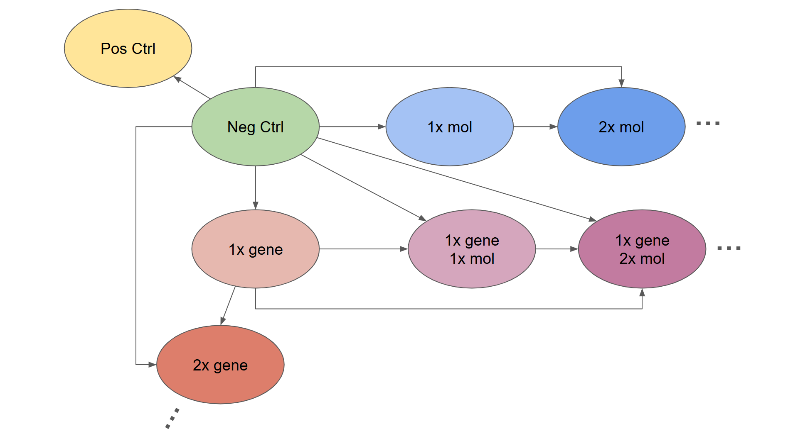
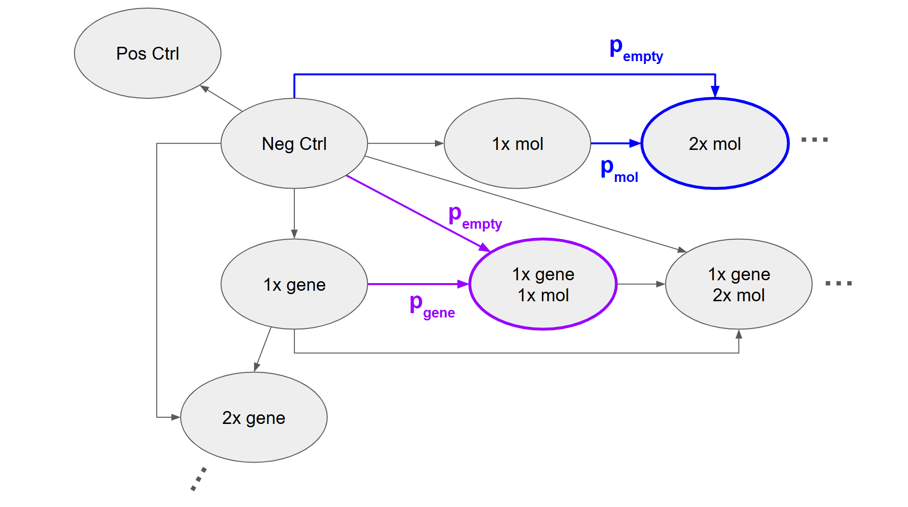

# HookeTx
Repository for Transcriptomics perturbation prediction

## Setup

Requires [uv](https://docs.astral.sh/uv/) and Python 3.10–3.12 (PyG wheels do not support 3.13 yet).

```bash
# Install dependencies into .venv
uv sync
```

Activate the environment:

```bash
source .venv/bin/activate
```

## Running an experiment (trek_drugscreen template)

From the repo root, run

```bash
python main.py
```

The app uses Hydra with the `configs/templates/trek_drugscreen/cfg.yaml` template. Override any option from the CLI, e.g.:

```bash
python main.py trainer.max_epochs=1 trainer.batch_size_train=16
```

## Running a sweep

From the repo root, initialize the sweep

```bash
wandb sweep sweeps/example.yaml
```

A sweep ID will be returned in the terminal. Copy it into the launch script (`launch/sweep.sh`), adjust the number of batch jobs (`#SBATCH --array=1-N%K`) to the overall number of runs (`N`) and how many should run at the same time (`K`) and launch the sweep:

```bash
sbatch launch/sweep.sh
```

## Data handling

This repo provides a brand new **routing mechanic** that allows us to learn transitions between flexibly configurable start and end states by specifying probabilities for which start state to sample given a given end state.

This not only allows us to train in a **drugscreen** and **cross cell type settings** but also mixtures of both or setups beyond our current use cases.

 

