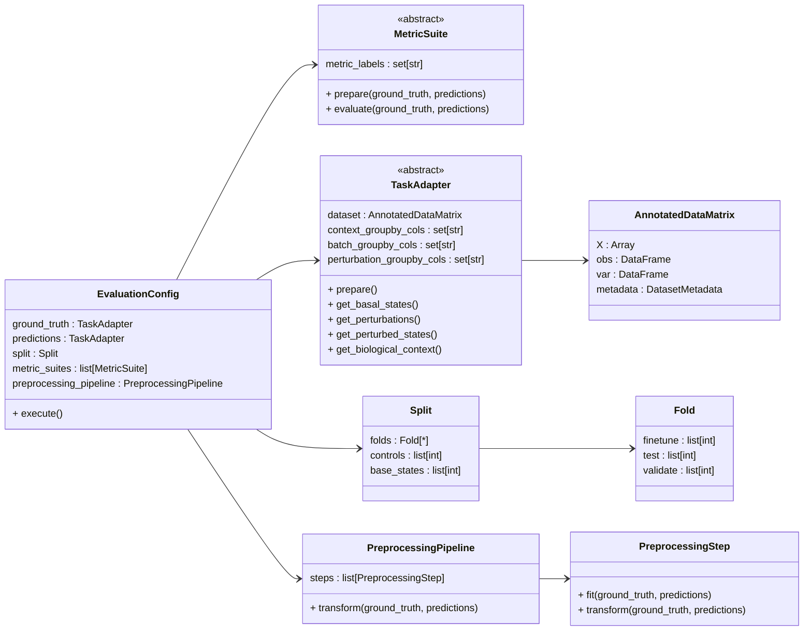

# Virtual Cell Benchmark (VCB)

Intended to be a temporary repository, but you never know...

## Install

We recommend using [`uv`](https://docs.astral.sh/uv/).
```bash
uv sync
```

> [!WARNING]
> If the installation hangs on resolving the dependencies, make sure you are authenticated to Github
> using SSH (i.e. `ssh-add`). We're installling [TxAM](https://github.com/valence-labs/txam-inference)
> from a private repository, and `uv` doesn't support other authentication method, 
> nor does it throw an error message in case authentication details are missing. It rather just gets stuck!
> See also [this Github issue](https://github.com/astral-sh/uv/issues/3783).

## Usage

Installing this package makes a CLI command available.

### Evaluate model predictions:
```bash
uv run vcb evaluate predictions --help
uv run vcb evaluate predictions [tx/px] \
     -p <path_to_predictions_dir> \
     -t <path_to_groundtruth_dir> \
     -s <split path> \
     -o <results_save_path> \
     -v <path_to_predictions_var> [options]
```

### Evaluate baselines:
```bash
uv run vcb evaluate baseline --help
uv run vcb evaluate baseline [tx/px/...] <path_to_groundtruth_dir> <path_to_split_json> <split_index> <baseline_type> <results_save_path>
```

## Development



The above overview presents the main classes. 

- To add a new task, implement a new `TaskAdapter`.
- To add a new preprocessing step, implement a new `PreprocessingStep`.
- To add a new metric, add an entry to the relevant metric suite or implement a new suite.
- To add a new baseline, implement a `BaseBaseline` and add an entry to `vcb.baselines.BASELINE`.

To run a new experiment with existing pieces, define a new `EvaluationConfig`.
